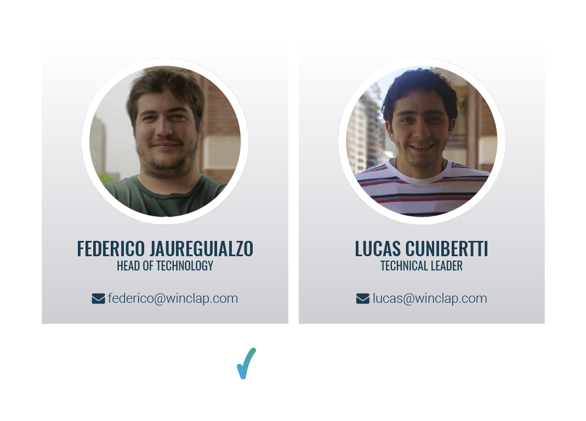
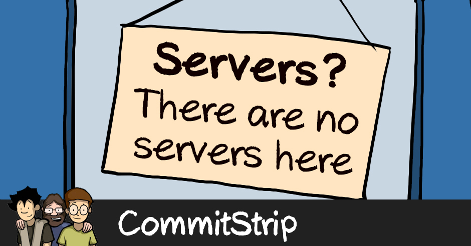
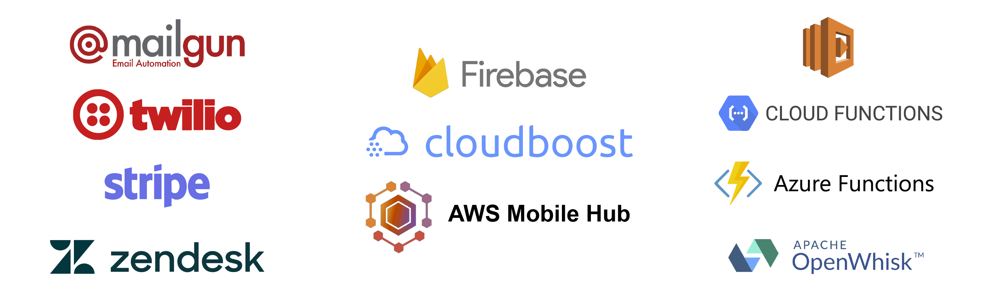
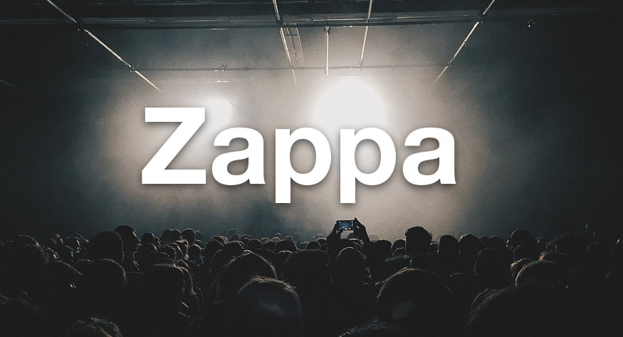

### Hola...
{width=695px height=500px}

<aside class="notes">

</aside>

# Data Center Propio
{width=550px height=400px}

# Cloud Computing
{width=700px height=400px}

# Serverless
{width=700px height=400px}

#


# Qué es Serverless?

Es un modelo de ejecución en el cual el proveedor de cómputo administra dinámicamente la asignación de los recursos de la máquina.

El precio se basa en la cantidad real de recursos consumidos por una aplicación, en lugar de las unidades de capacidad adquiridas previamente.

From [Wikipedia](https://en.wikipedia.org/wiki/Serverless_computing)

# SaaS vs BaaS vs FaaS


#
## FaaS: Function as a Service

* Funciones de propósitos específicos
* Manejado por eventos
* Infraestructura abstracta
* Ambientes efímeros
* Se paga por los recursos consumidos
* Auto escalable

#
## Cómo funciona FaaS?


#
## Casos de Uso

#
## Beneficios y/o Limitaciones

#
## Python y FaaS

* AWS Lambda: Python 2.7, Python 3.6
* Google Cloud Functions: Python 2.7, Python >=3.4
* Microsoft Azure Functions: Python está en modo experimental.
* IBM Apache OpenWhisk: no soporta Python nativamente. Puede correr código customizado en un container de Docker.

#
## Serverless Frameworks
Facilitan la configuración y el deploy de las aplicaciones


# Zappa

#


#


#
## Aplicaciones python Serverless basadas en eventos
### ¡¡Incluyendo aplicaciones web WSGI!!

# Features

#
* Python WSGI Applications
* Microservicios (Flask)
* Macroservicios (Django)

#
### Más Features ...
* Eventos en AWS (API Gateway/S3/Kinesis/DynamoDB/SNS/SES/Alexa/...)
* Tareas calendarizadas (Cron-like)
* Ejecución de tareas asincrónicas
* Múltiples Entornos (Environments)

#
### Aún más ...
* Certifcados SSL
* Invocación de Funciones Remotamente
* Logs
* Rollback
* Undeploy

# ...
* Compatibilidad con VPC
* Keep Warm
* Django Management Commands
* Disponibilidad global
* Variables de Entorno Remotas vía S3
* C-extensions vía lambda-packages y manylinux wheels

# Instalación
```bash
$ pip install zappa
```

# Configuración
```bash
$ zappa init
```

#
## zappa_settings.json
```
{
    "dev": {
        "app_function": "my_module.app",
        "aws_region": "us-east-1",
        "profile_name": "default",
        "project_name": "zappa-project",
        "runtime": "python3.6",
        "s3_bucket": "zappa-bucket"
    }
}
```

#
## zappa_settings.yml
```
dev:
    app_function: my_module.app
    aws_region: us-east-1
    profile_name: default
    project_name: zappa-project
    runtime: python3.6
    s3_bucket: zappa-bucket
```

# Deploy
```bash
$ zappa deploy dev
Deploying..
Your application is now live at: https://7k6anj0k99.execute-api.us-east-1.amazonaws.com/dev
```

# Monitoreo
```bash
$ zappa tail dev --since 10m --filter "GET"
```

# Develop
```bash
$ zappa update dev
Updating..
Your application is now live at: https://7k6anj0k99.execute-api.us-east-1.amazonaws.com/dev
```

#
{width=600px height=600px}

# Rollback
```bash
$ zappa rollback dev -n 1
```

# Scheduling
```
{
    "dev": {
       ...
       "events": [{
           "function": "your_module.your_function",
           "expression": "rate(1 minute)"
       }],
       ...
    }
}
```

```bash
$ zappa schedule dev
```
```bash
$ zappa unschedule dev
```

# Y mucho más ...

# Let's go rock
## (Demo time)

# ¿Preguntas?

# ¡Muchas Gracias!

